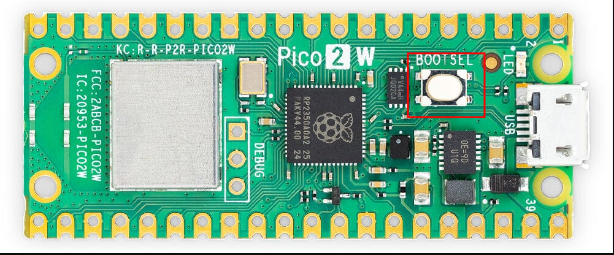
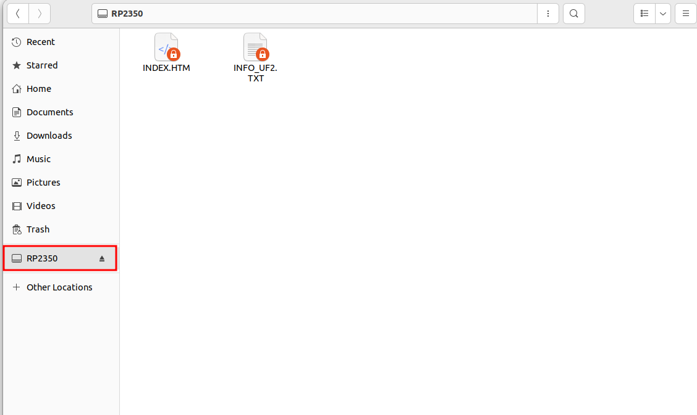
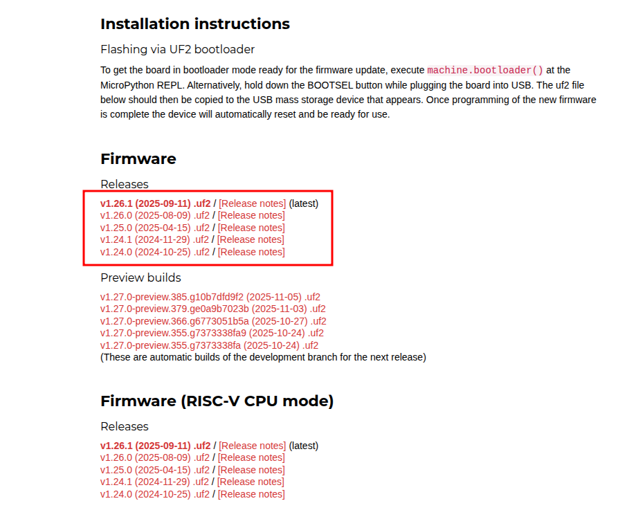
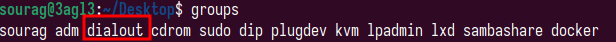
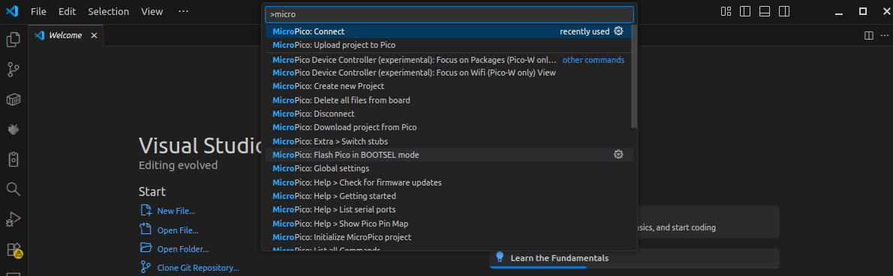
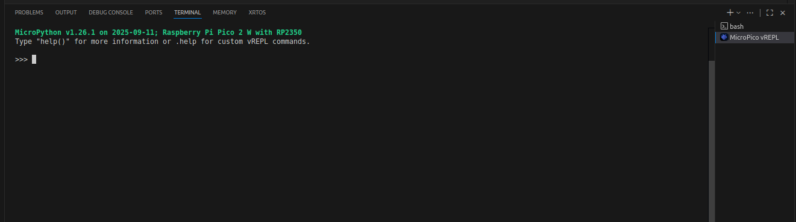
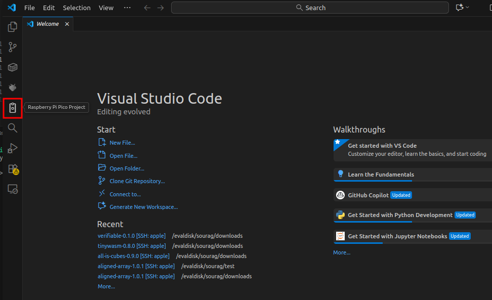
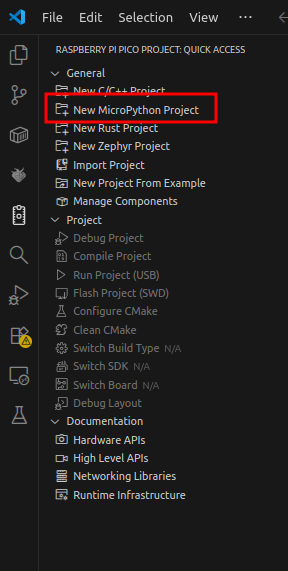
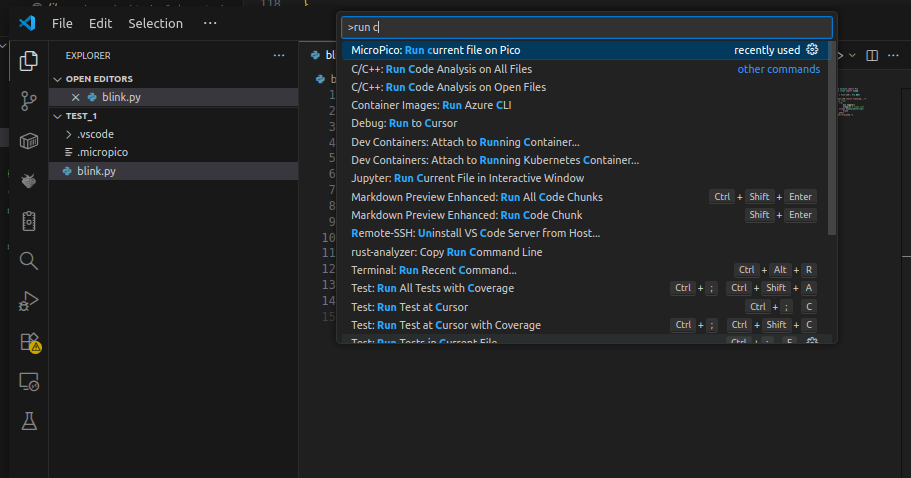

### Required components

You will need to buy the following components to complete all the labs in the course. Note that you won't need all of them for part0. But we suggest buying everything together.  
You are not required to purchase from the given links. But make sure you buy the same component.

- 2 x Raspberry Pi Pico 2 W - [https://www.adafruit.com/product/6315](https://www.adafruit.com/product/6315)  
- 1 x Breadboard - [https://www.adafruit.com/product/239](https://www.adafruit.com/product/239)  
- M/M wires - [https://www.adafruit.com/product/153](https://www.adafruit.com/product/153)  
- F/M wires - [https://www.adafruit.com/product/1954](https://www.adafruit.com/product/1954)  
- 2 x I2C 1602 LCD - [https://a.co/d/0gvIQbVn](https://a.co/d/0gvIQbVn)  
- 2 x 4 x 4 keypad - [https://a.co/d/06ZlNiY5](https://a.co/d/06ZlNiY5)  
- 2 x Micro usb cable - [https://a.co/d/0edLVa0k](https://a.co/d/0edLVa0k)  

Note that the link above for the keypad and micro USB cable is for a pack of two. So if you use that link, only purchase one item.

For this course, we will be using Raspberry Pi Pico 2 W as our IoT device and MicroPython as the language to program the board. The setup shown here is for linux machines. But most of it should remain the same for Windows as well.

The instructions are divided into 3 steps:
- [Setup](#setup)
- [Using vscode](#writing-and-running-code-with-vs-code) to connect to the board
- [First project](#first-project)

### Setup

First, we need to flash the board with a MicroPython firmware so that it can run MicroPython code.

1. Enter Bootloader Mode
    - Plug the device into your computer while holding the BOOTSEL button.
This is the small white button next to the Micro-USB connector on the board.
[1]
    - The board will appear as a USB storage device named something like RP2350 in your file explorer.


2. Download MicroPython Firmware
    - Go to the official [MicroPython firmware page for the Pico 2 W](https://micropython.org/download/RPI_PICO2_W/). Make sure you use the `_W` (wireless) page and not the plain `RPI_PICO2` page, they are different builds, and only the `_W` build includes WiFi/Bluetooth support, which later parts of this course depend on.
    - Download the latest .uf2 file from the “Firmware” section, **not** from the “Firmware (RISC-V CPU mode)” section. We’ll be using the ARM version for this project.
    

3. Flash the Firmware
    - Either drag and drop the downloaded .uf2 file onto the `storage name` drive using your file explorer, or run the following command in a terminal:
        ```sh
        cp ~/Downloads/<firmware name>.uf2 /media/$USER/<storage name>/
        ```
        Where the `firmware name` is the name of the downloaded firmware file and `storage name` is the name in which the board appear in the file explorer.
    - Once copied, the board will automatically disconnect and reboot into program execution mode.
4. Verify the Serial Device
    - After reboot, you should see a new character device:
        ```sh
        /dev/ttyACMn
        ```
        Where the `n` depends on how many serial devies are already connected to your computer.
        This represents the serial interface used to communicate with your board.

5. Fix Permissions
    - To access the board without sudo, add your user to the dialout group:
        ```sh
        sudo usermod -a -G dialout $USER
        ```
    - Reboot your system.
    Afterwards, check with:
        ```sh
        groups
        ```
        

        You should see dialout listed among your groups.


### Writing and Running Code with VS Code

Next, we’ll set up an IDE to write and upload code to the Pico.
1. Install VS Code
    - Download and install [Visual Studio Code](https://code.visualstudio.com/).

2. Install MicroPico Extension
    - Open VS Code and go to Extensions -> search for “Raspberry Pi Pico”
or install it directly from [this link](https://marketplace.visualstudio.com/items?itemName=raspberry-pi.raspberry-pi-pico).
3. Connect to the Board
    - Open the Command Palette with `Ctrl + Shift + P`.
    - Type `MicroPico: Connect` and select it.
    
    - Once connected, you’ll see a MicroPython REPL (interactive prompt) open in the VS Code terminal window.
    

4. Verify You Flashed the Right Firmware
    - In the REPL, run:
        ```python
        import os
        os.uname()
        ```
    - Check the `machine` field of the output. It should mention `Pico2 W`. If it doesn't mention `W`, you flashed the non-wireless firmware by mistake, go back to [Setup](#setup) and re-flash using the `RPI_PICO2_W` firmware page. Catching this now saves you from a confusing WiFi/Bluetooth failure much later in the course.

### First project

On the left sidebar of VS Code, you should see an option called `Raspberry Pi Pico Project`.
Select it, then choose `New MicroPython Project`.




Name the project `blink`, select a location, and create the new project.
You’ll notice that some starter code is already present in `blink/main.py`.

To test that everything is set up correctly:
- Open `blink/main.py`
- Open the Command Palette again (`Ctrl + Shift + P`)
- Make sure you are still connected to the board following the previous step
- Search for and select `Run Current File on Pico`



If everything worked correctly, the LED on your Pico board should start blinking.

##### Image credits
[1] https://www.pi-shop.ch/raspberry-pi-pico-2-w  
