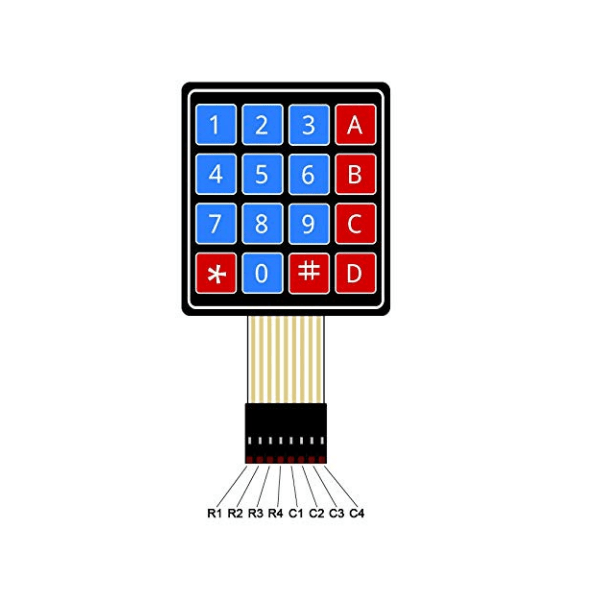
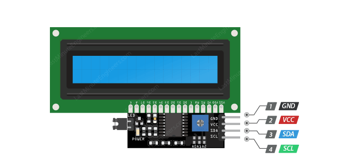
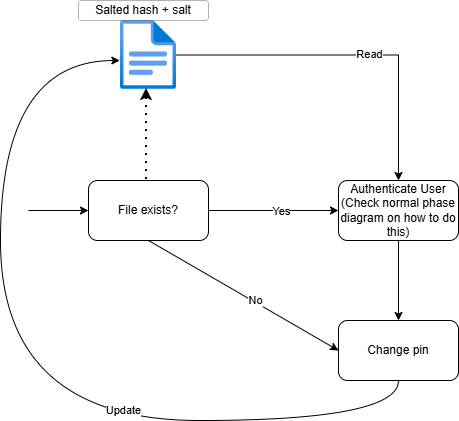
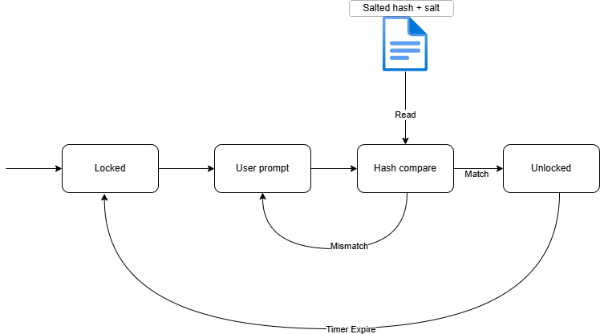

This step will help you get familiar with using a cryptographic function to hash data that is stored locally on the Pico.

### Required components

You will need the following components:
- 1 × 4 × 4 keypad
- 10+ Jumper wires
- I2C LCD 1602

No external pull-down resistors are needed for the keypad - the columns are wired directly into GPIO pins configured with the Pico's internal pull-down (`machine.Pin.PULL_DOWN`).

Read about how the 4 × 4 keypad works [here](https://docs.sunfounder.com/projects/kepler-kit/en/latest/component/component_keypad.html#cpn-keypad).  
Pinout for the keypad is as follows where the R represents the row pins, and C represents the column pins:

[1]

Pinout for the LCD is as follows:

[2]

The LCD uses I2C protocol for communication. Read more about the protocol [here](https://en.wikipedia.org/wiki/I2C) and [here](https://learn.sparkfun.com/tutorials/i2c/all). Read about the working of the LCD [here](https://lastminuteengineers.com/i2c-lcd-arduino-tutorial/).

#### Troubleshooting: "No LCD found" / `OSError: [Errno 5] EIO`
If `i2c.scan()` finds nothing, double check wiring first (SDA/SCL not swapped, GND actually connected, jumpers fully seated) - these account for most cases.

If the scan *does* find the LCD's address (e.g. `0x27`) but any write raises `OSError: [Errno 5] EIO`, the LCD itself is not necessarily broken. This has been observed with some kits' LCD backpacks: the Pico's hardware I2C peripheral (`machine.I2C`) is stricter about signal timing than a software (bit-banged) implementation, and a marginal connection (e.g. weak pull-ups on the backpack plus breadboard capacitance) that's enough for the short address-ACK to succeed can still make the fuller data-write transaction fail. Swapping `machine.I2C` for `machine.SoftI2C` (same constructor args) in `init.py`/`main.py` has resolved this in testing, at the cost of slower, CPU-driven I2C instead of the RP2040's dedicated hardware peripheral. If you hit this, try that swap before assuming the LCD is defective.

*The LCD is required for this part. The lock's status and prompts are shown on it, not printed to the REPL.*  
Code to interact with the LCD is [here](part1_starter_code/lcd.py)

### What you need to build
The starter code intentionally does not include the storage/input layer in `common.py`. You're expected to build it yourself. At minimum, you'll need to implement:
- `pin_exists()` — whether a PIN has already been stored on-device
- `store_pin(pin_hash, salt)` / `load_pin()` — persist and retrieve the stored hash + salt
- `get_input_string(n)` — read `n` keypresses from the keypad, debouncing so a held key isn't read multiple times
- `validate_pin(input_pin)` — hash the input with the stored salt and compare against the stored hash. Use a **constant-time comparison**, not `==`.

> **Q1.** Why is comparing the two hashes with a plain `==` a bad idea here? What could an attacker learn from *how long* the comparison takes, and how does a constant-time comparison fix that?

The `init_phase`/`normal_phase` folder split in the starter code is just for organizational clarity. Feel free to restructure however you combine files on the actual device filesystem.

The init phase and normal phase details are in the following sections:
- [Init](#init-phase)
- [Normal](#normal-operational-phase)

### Init phase

This phase is meant to emulate a user buying a smart lock and setting a pin that they will later use to unlock the lock.
We will not store the pin in plaintext. Instead, we will store a **salted hash** of the pin, with the salt kept alongside it, on-device.

_**Note:** You're free to use any hash function for this assignment (e.g. `sha256`) - a fast hash is fine for completing the task. In practice, though, PIN/password stores often use *slow* hashes (e.g. bcrypt, scrypt, Argon2, PBKDF2) instead. Making each hash attempt take longer doesn't affect a legitimate login noticeably, but it drastically slows down an attacker brute-forcing the PIN offline against a stolen `pin_store.json`._

> **Q2.** Why shouldn't the PIN be stored in plaintext? And given we're already hashing it, why do we still need a salt on top of that? Think about what an attacker could do with a copy of `pin_store.json` in each of these three cases: plaintext, hash only, salted hash.

You can find the starter code for this phase [here](part1_starter_code/init_phase/init.py).

An additional functionality you need to implement is what happens when a user tries to change a pin when there is already a pin stored locally.
In this case, the user must authenticate with the original PIN before changing it.  
**Implement this once you have the normal phase part working.**

Typical flow of operations is shown below:

### Normal operational phase
This step simulates the normal operational phase that a smart lock might go through. This phase should not allow PIN change functionality. _We are keeping this restriction only for this part to separate the functionalities. Setting and resetting the PIN is `init.py`'s job, and regular unlocking is `main.py`'s job. Later parts will have this merged into a single file._

- Device always starts in the locked state
- User prompted to enter the unlock pin
- Pin is hashed using stored salt and compared with stored hash
- If correct, the device unlocks for a brief period
    - Device automatically locks after a delay
- If incorrect, an error message is shown on the LCD (We will add more functionality for this case in later steps)

You can find the starter code for this phase [here](part1_starter_code/normal_phase/main.py). Note that the file is named `main.py` intentionally so that each time the board is turned on, this code will be run.

Typical flow of operations is shown below:

Since we named this file `main.py`, when you disconnect and reconnect the pico, this file should be run by default. If it does not, make sure you manually disconnect the pico from vscode using `Ctrl + Shift + P`, typing in `MicroPico: Disconnect` and selecting it while the pico is plugged in. Else it will automatically spawn the REPL window waiting for an input rather than running your script.

#### Image credits
[1] https://shop.cretechs.in/product/4x4-matrix-membrane-type-keypad-16-keys/  
[2] https://lastminuteengineers.com/i2c-lcd-arduino-tutorial/